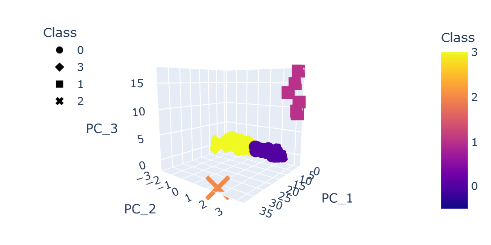
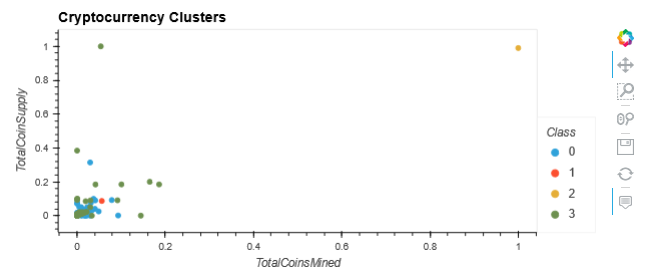

# cryptocurrencies

# Overview
This project uses unsupervised machine learning to cluster different types of bitcoins based on their algorithm, proof type, how many of them have been mined, and how many there are of them in total.

# Results

